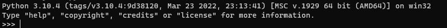
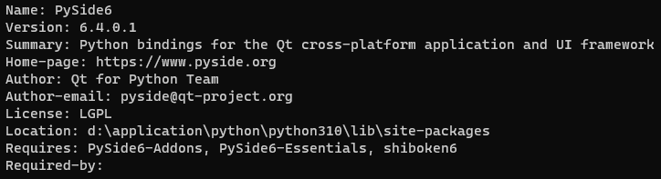

# PySide6简介

*Qt*是一款C++跨平台图形用户界面应用程序开发框架，完全面向对象，易扩展，实现了组件化编程。

PySide6是*Qt*的Python封装，支持*Qt* 6.0框架，其开源协议为[LGPLv3](https://tldrlegal.com/license/gnu-lesser-general-public-license-v3-(lgpl-3))/[GPLv2](https://tldrlegal.com/license/gnu-general-public-license-v2)，具体介绍可参考官网【[Qt for Python - Qt Wiki](https://wiki.qt.io/Qt_for_Python)】。

在创建基于组件的图形界面程序时，通常会用到以下三个模块：

* QtCore--提供基础功能，如信号和槽，属性系统，对象模型，文件系统，序列化等；
* QtGui--拓展了QtCore的图形界面功能，包括事件，窗口和屏幕，2D绘图及图像文本等；
* QtWidgets--提供了可用的组件，包括窗体及各类控件（按钮，文本框，输入框，菜单等）。

更多组件内容可参考官网的组件说明【[Qt for Python - Modules API](https://doc.qt.io/qtforpython-6/api.html)】。

接下来，将以Windows 10下的环境为例，来介绍PySide6的具体使用。

* 环境准备：

1. 操作系统：        Windows 10
2. Python版本：      3.10.4

* 安装：

1. 安装Python：
   直接在【[Python官网](https://www.python.org/downloads/)】下载指定版本3.10.4安装程序，然后双击安装即可。安装完成后，在命令行窗口输入Python，有如下结果即证明安装正确：
   
2. 安装PySide6：
   直接在命令行输入*pip install pyside6*安装，等待安装完成即可。可通过*pip show pyside6*查看安装后的信息：
   
