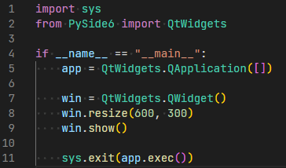
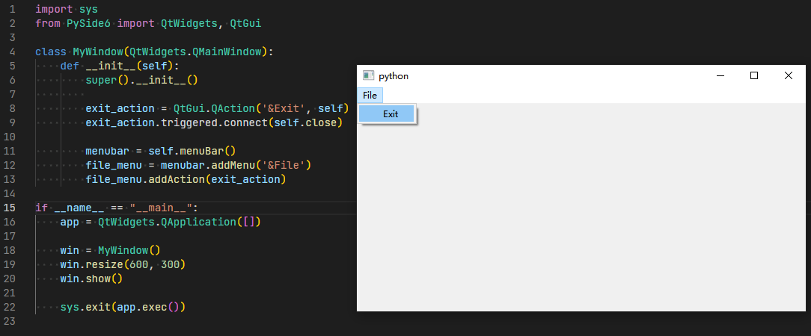

# 窗体与控件

PySide6中有各类丰富的控件，与Qt中的用法基本一致，只是带有Python语言的特性。常用控件包括窗体，菜单，对话框，输入框，文本框等等，一个完整的图形界面程序依赖于各类控件来实现。

以下是一个简单的示例：

首先需要引用PySide6包，然后使用其中的组件展示即可。

接下来实现一个自定义组件类，丰富界面的功能。

这里新建了自定义类MyWindow，继承自系统主窗体类QMainWindow，包含一些基本属性，在初始化函数__init__里面，在默认菜单栏增加了菜单项及其响应操作。
