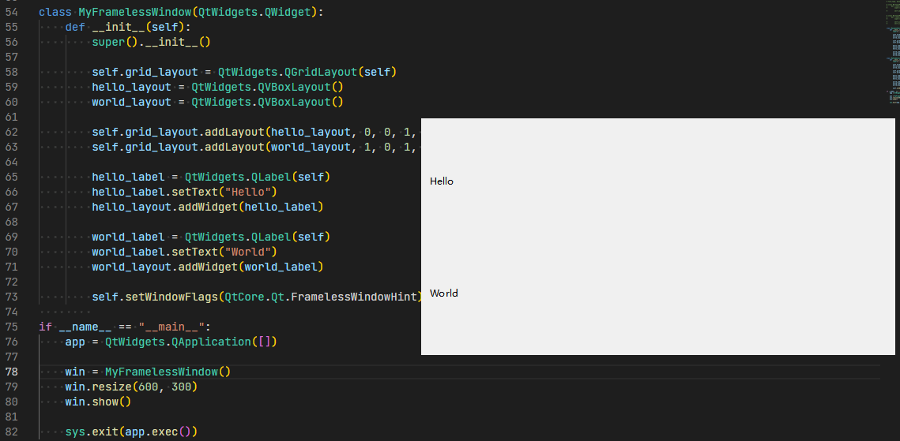
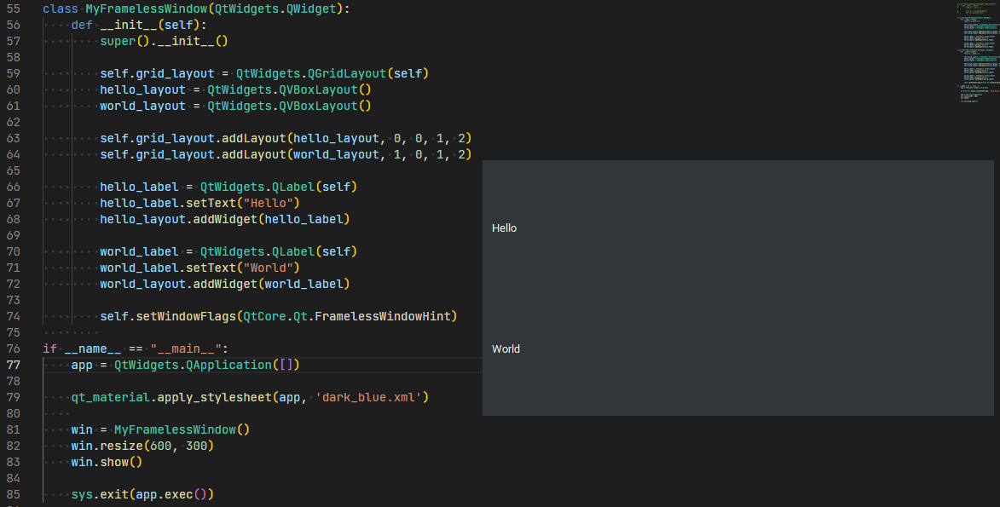
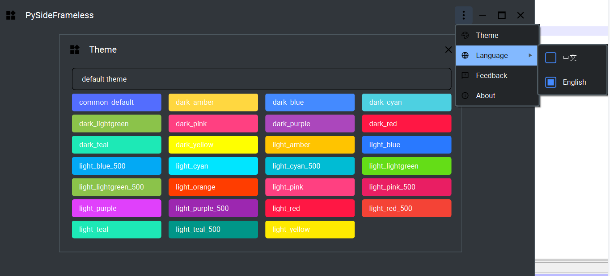

# 无边框窗体

PySide6中使用的是系统默认窗体以及风格，一般来说可以满足常规需要，但是很多时候，对于图形界面往往有更高的要求，譬如自定义标题栏，增加美观程度等。

对于自定义的场景，常常会使用无边框窗体。它是取消了系统窗体的默认标题栏，转而由开发者自定义。

将默认窗体设置为无边框，主要通过setWindowFlags函数设置窗体标志Qt.FramelessWindowHint，示例如下：

如果希望界面增加更多风格，或者看起来更美观，可以使用开源库【[qt_material](https://github.com/UN-GCPDS/qt-material)】，通过简单设置即可获取不一样的界面风格，示例如下：

当然，也可以使用我们开源的【[PySideFrameless](https://github.com/iounce/PySideFrameless)】无边框窗体库，封装了更多常规操作，开箱即用，示例如下：

