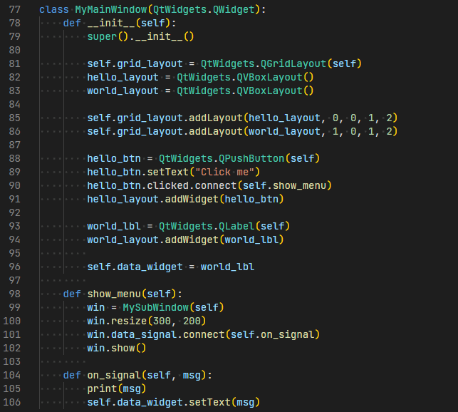
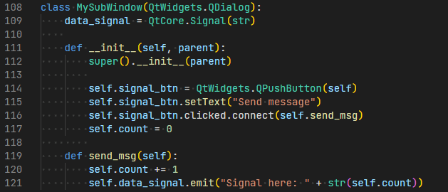
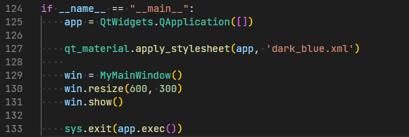

# 第五章 窗体间通信

PySide6中使用多个窗体的时候，常常会涉及到窗体间的数据传递，在Qt中常用的是信号与槽，PySide6中也有类似的处理机制，通常是使用信号Signal。

在一个窗体种定义类属性的Signal信号变量，在需要的地方调用其emit函数发送信号。然后，在另外一个窗体中调用信号的connect函数，绑定此信号的处理函数，这样就可以获取此前发送的数据。

示例如下：

