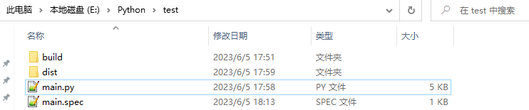
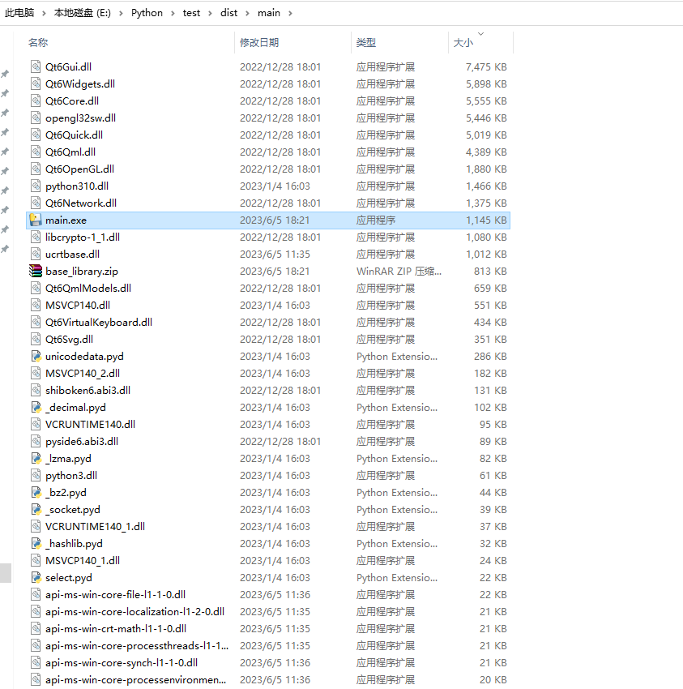

# 打包

PySide6窗体程序打包，一般使用Pyinstaller打包工具，它可以很方便的将Python脚本打包为可执行程序。

下面以Windows下操作为例，来作简单介绍。

首先使用命令*pip install pyinstaller*安装Pyinstaller工具，可用*pip show pyinstaller*查看安装结果：

Pyinstaller工具的常用参数如下：
* -F：打包Python程序为单个可执行文件；
* -D：打包Python程序为一个文件夹；
* -i：生成图标，只适用于Windows平台；
* -n：指定打包后生成文件的名称；
* -w：禁止命令行对话框弹出。

更多其他参数，可参考Pyinstaller工具相关文档。

接下来，将如下PySide6窗体程序打包：

直接打包为单一可执行文件，执行如下操作：
*Pyinstaller -F -w main.py -p D:\Application\Python\Python310\Lib\site-packages*

此处加了PySide6的安装路径，便于打包程序找到相关依赖文件。

执行命令后，生成文件如下：

其中main.spec为打包配置文件，可手动修改：

build目录为编译生成的中间文件：

dist目录才是最终可执行文件目录：

此时，双击dist目录下的main.exe即可打开最终打包的程序。

如果将参数-F改为-D，执行命令：
*Pyinstaller -D -w main.py -p D:\Application\Python\Python310\Lib\site-packages*

这个时候，除了main.exe，还会生成其他多个依赖文件，具体如下：
