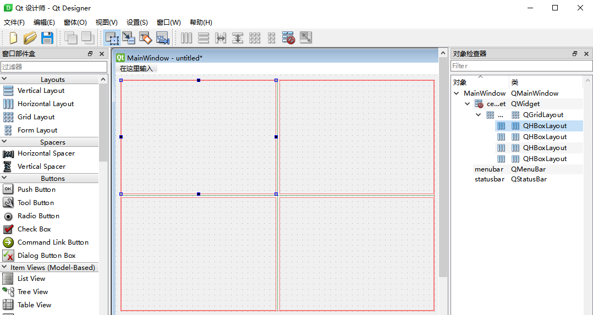
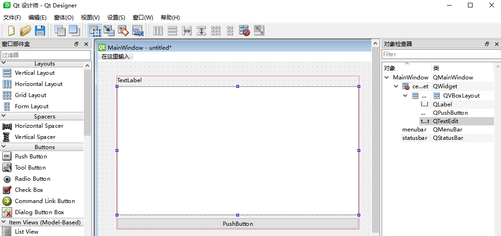
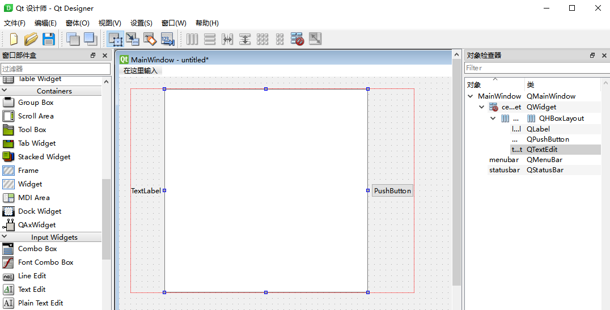
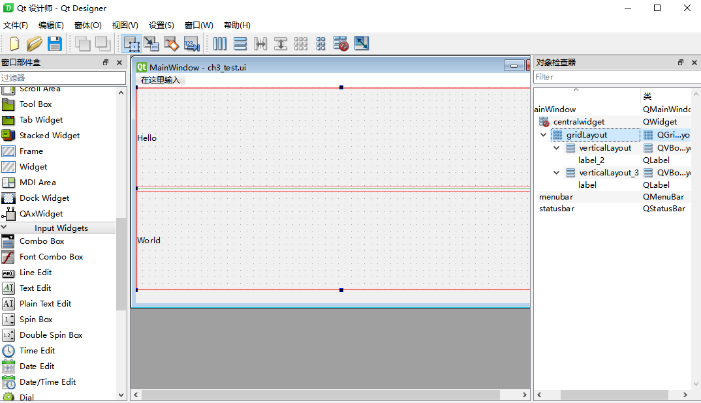
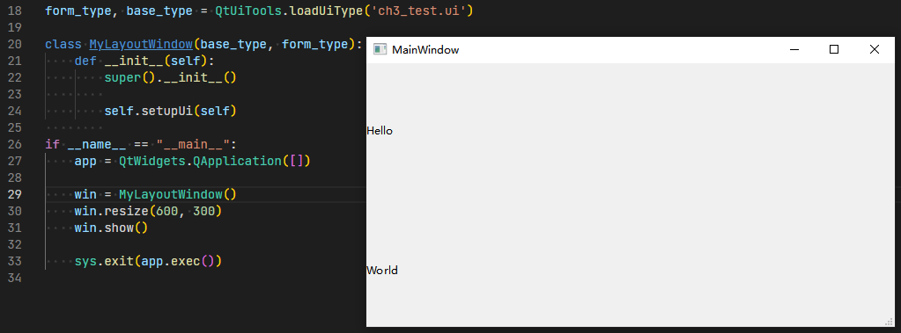
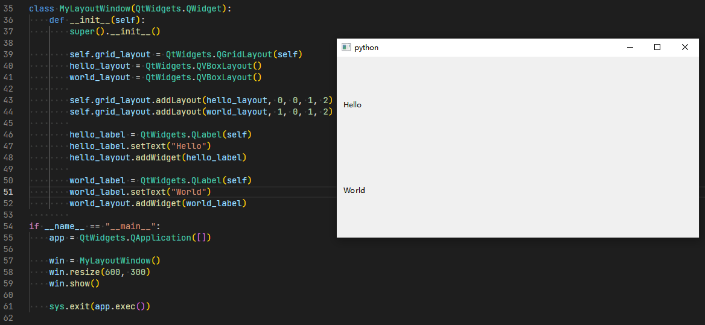

# 第三章 窗体与布局

PySide6中常见的布局控件有网格布局控件QGridLayout，垂直布局控件QVBoxLayout和水平布局控件QHBoxLayout。具体用法如下：

* QGridLayout：通常用于将空间分割为不同行列的单元格，可以自适应窗体大小；
  

* QVBoxLayout：通常用于将控件垂直对齐，即上下排列，可以自适应窗体大小；
  
  
* QHBoxLayout：通常用于将控件水平对齐，即左右排列，可以自适应窗体大小。
  

对窗体控件进行布局，可以采用安装包提供的设计工具【Qt *designer*】来编辑，或者直接使用编码的方式来实现。

* 采用设计工具实现：
  打开设计工具，然后新建主窗体，增加一个网格布局控件QGridLayout，在其上面添加两个垂直布局控件QVBoxLayout，将界面分为上下两个部分。然后，分别在QVBoxLayout布局中添加QLabel控件。

  

  * 直接调用ui文件：
    首先需要解析出ui文件中的窗体类和基类，然后实现自定义类即可：

  

  * 调用编译后的ui文件：
    首先需要使用*pyside6-uic ch3_test.ui > ch3_test.py*命令生成Python文件，然后引用界面类Ui_MainWindow即可：

  
* 采用直接编码实现：

  编码实现首先需要明确具体的布局，然后再编码实现，相对于设计工具而言要求更高，但是更为灵活，且不需要依赖ui文件。

  

说明：

designer.exe工具可在Python安装目录找到，参考路径：D:\Python\Python310\Lib\site-packages\PySide6\designer.exe
pyside6-uic.exe工具可在Python安装目录找到，参考路径：D:\Python\Python310\Scripts\pyside6-uic.exe
