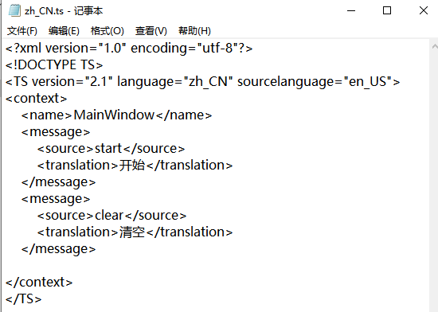
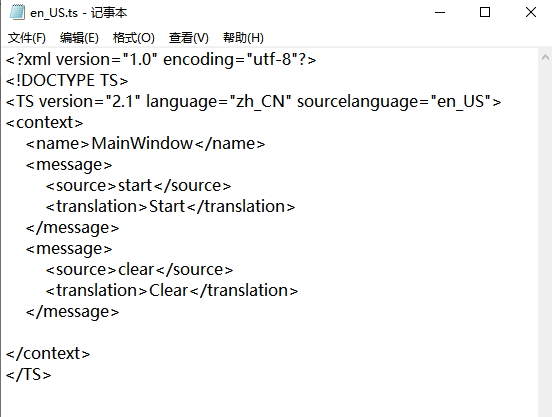
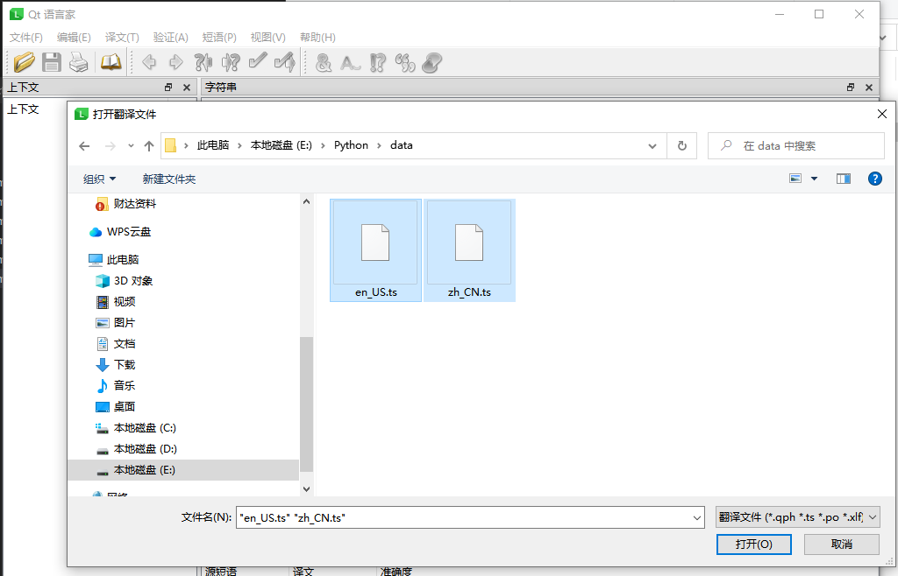
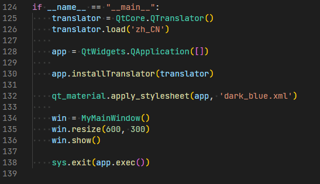

# 第六章 国际化

PySide6中使用窗体的时候，会广泛使用到各种文本信息，如果需要支持多语言的话，通常会比较复杂。

PySide6中可以使用语言工具【Qt *Linguist*】来转换不同的语言。

首先获取窗体文件的中文翻译源文件即ts文件，譬如，可使用命令*pyside6-lupdate main.py -ts zh_CN.ts*获取初步的翻译源文件。

然后可以手动编辑zh_CN.ts文件，增加中文文本转换。示例如下：

接下来，拷贝一份，修改文件为en_US.ts，然后将中文手动翻译为英文。示例如下：

翻译源文件手动编辑完成后，就可以使用语言工具【Qt *Linguist*】将ts文件转换为目标翻译文件qm文件。

打开ts文件，可同时打开多个：

选择发布全部，就会在当前路径生成zh_CN.qm和en_US.qm文件：

最后在主程序中直接加载即可：

如果要动态切换，则需要在菜单中手动操作，切换为不同的目标语言。

说明：

designer.exe工具可在Python安装目录找到，参考路径：D:\Python\Python310\Lib\site-packages\PySide6\linguist.exe
pyside6-lupdate.exe工具可在Python安装目录找到，参考路径：D:\Python\Python310\Scripts\.pyside6-lupdateexe

